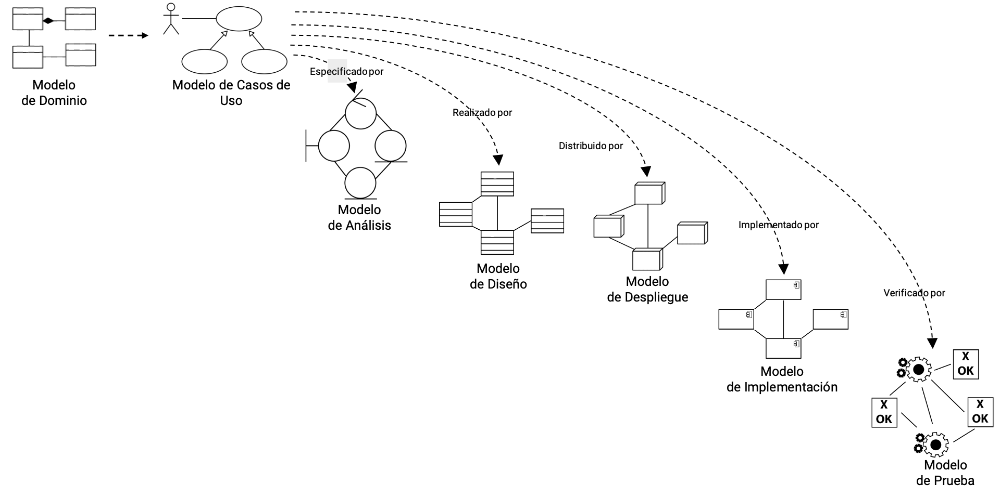
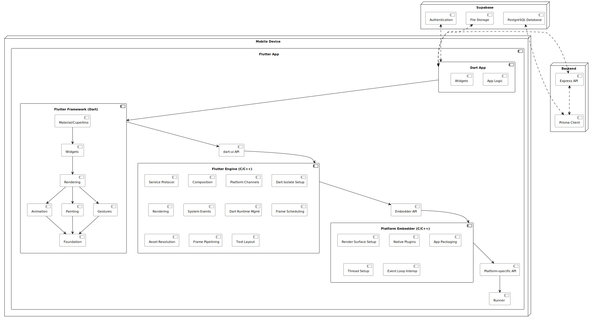
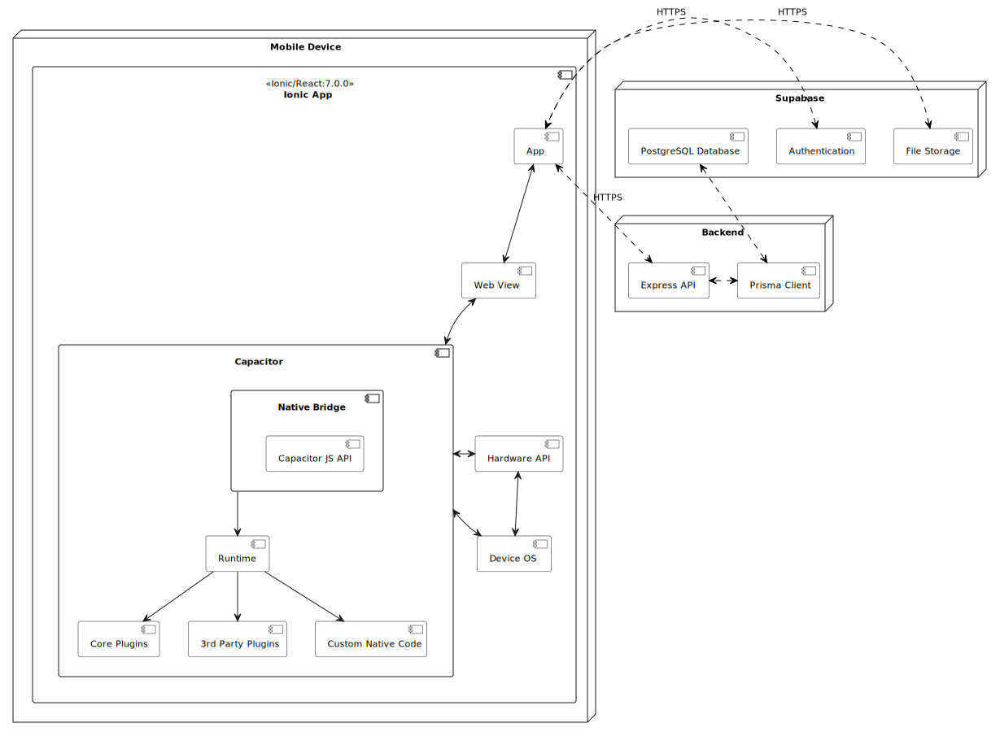

# Comparación y Evaluación de cinco Frameworks Web de Backend

## Descripción Aplicación
Es una aplicación móvil diseñada para la gestión de eventos e interacción entre usuarios. Incluye funcionalidades esenciales como la administración de eventos, la conexión entre usuarios y características sociales, tales como seguidores, notificaciones y comentarios.

## Implementación
Aplicación móvil implementada en 3 frameworks de desarrollo móvil distintos:
- React Native: https://github.com/valeraruggierotesisucv/reactNative-app
- Flutter: https://github.com/valeraruggierotesisucv/flutter-app
- Ionic: https://github.com/valeraruggierotesisucv/ionic-app

## Metodología
La aplicación esta requisitada y diseñada usando la metodología RUP. Al ser una metodología dirigida por casos de uso, se podrá realizar una traza desde los requisitos, hasta el código implementado en cada framework. Esta trazabiliad permite verificar la transformación de los requisitos en elementos de modelo sucesores, resultantes del análisis y diseño, implementación, pruebas y despliegue. De esta manera se podrá comparar cada framework y las aplicaciones resultantes de manera más efectiva.

|  Trazabilidad de Requisitos por disciplinas |
| :---: |

## Requisitos
Dada la extensión de los casos de uso, estos fueron organizados por paquetes

### Autenticación

### Manejo de Eventos

### Interacciones Sociales

### Manejo de Usuarios

### Especificaciones de casos de uso
La descripción de cada caso de uso lo podrá ver en: [Especificaciones de los casos de uso](Requisitos/Casos%20de%20Uso/UseCasesSpecification.md)

### Prototipo de pantallas
Los prototipos de las pantallas las podrá ver en: [Prototipo en Figma](https://www.figma.com/design/DONtPlkrGIl6SPWpOyRAzo/Eventify?node-id=2-197&t=Ajn1pEIF9eLvgRg2-1)

## Modelo de Análisis

### Diagrama de clases de análisis
#### Autenticación

#### Manejo de Eventos

#### Interacciones Sociales

#### Manejo de Usuarios

### Arquitectura de análisis

### Realización de análisis de casos de uso

#### Diagrama de clases de análisis de UC6 – Publicar Evento

#### Diagrama de colaboración de análisis de UC6 – Publicar Evento

## Modelo de Diseño Framework React Native

### Arquitectura de Sistema

### Caso de Estudio UC6 - Publicar Evento

#### Diagrama de Clases de Diseño

#### Diagrama de Secuencia

#### Trazabilidad con Clases de Análisis

## Modelo de Diseño Framework Flutter

### Arquitectura de Sistema

### Caso de Estudio UC6 - Publicar Evento

#### Diagrama de Clases de Diseño

#### Diagrama de Secuencia

#### Trazabilidad con Clases de Análisis

## Modelo de Diseño Framework Ionic

### Arquitectura de Sistema

### Caso de Estudio UC6 - Publicar Evento

#### Diagrama de Clases de Diseño

#### Diagrama de Secuencia

#### Trazabilidad con Clases de Análisis

